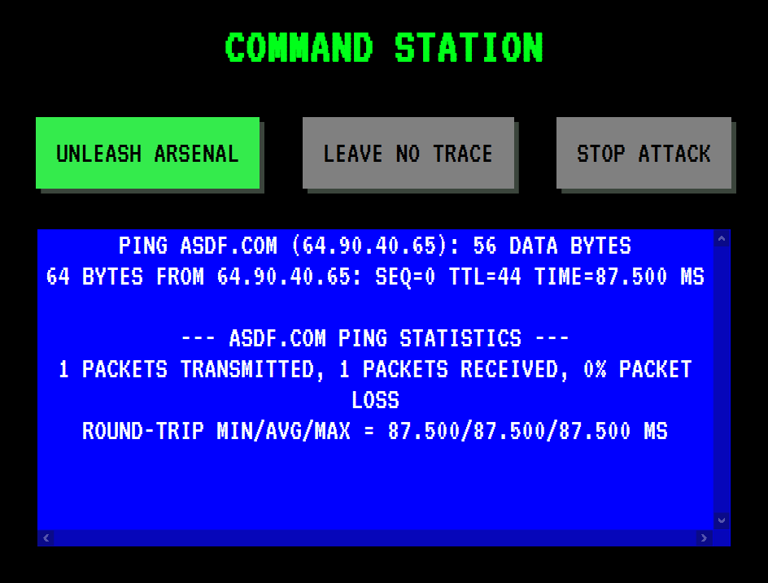

# command-station

A command station for the common nerd.

Create buttons for shell commands/tasks and trigger them from a no-frills web UI.



## Usage

```bash
git clone https://github.com/matthewjwhite/command-station && cd command-station
go build .
./command-station sample.yml # Button created for each command.
```

Now, navigate to `http://127.0.0.1:8000`.
